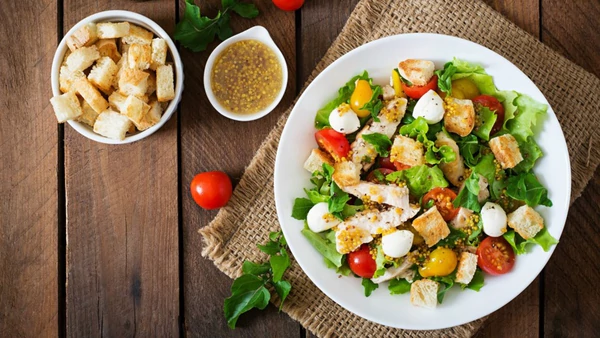
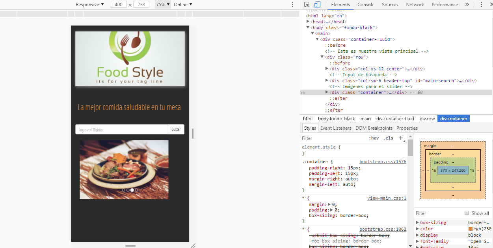

# F O O D M A P

Crea una web-app que a través de un input pueda filtrar los restaurantes que se encuentran cerca de ti (Tú decides la estructura que tendrán tus datos, puedes crear una lista de restaurantes en un arreglo, en un objeto, de manera individual. El diseño es totalmente libre).

_Objetivos_

Diseñar una app donde mediante un filtro podamos mostrar los restaurantes orgánicos según el distrito.

_Producto Final_

_Enfocado en :_

Basado en concientizar a las personas en la importancia de una nutrición saludable. Hoy en día la vida de la capital limeña tiene un ritmo bastante rápido, donde todo lo queremos para AYER! … Pero, realmente vale  la pena mal gastar nuestra salud por este desequilibrio nutricional ??? 
Una de las cosas que podemos notar es que no existe cultura de prevención, “es necesario replantear los hábitos de consumo, volver a comer tubérculos, raíces, granos andinos. Los productos andinos tienen más aminoácidos que los productos europeos”.

_Recursos_

* [Si de comer se trata](https://www.youtube.com/watch?v=XEq_bAAof5k)

* [La Kocina](http://blog.klikin.com/comida-organica-a-domicilio/)
